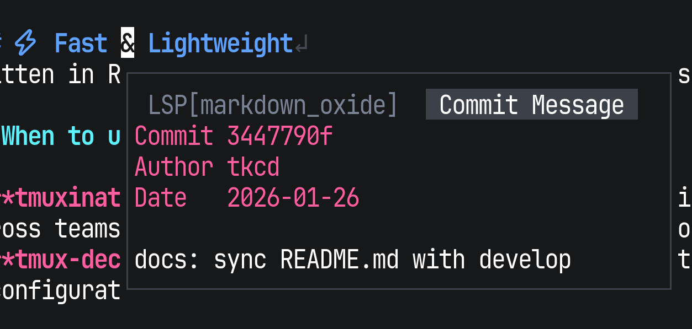

# hover-git.nvim

A [hover.nvim](https://github.com/lewis6991/hover.nvim) provider that shows the commit message of the line under the cursor.

Powered by `git blame`, it lets you quickly understand *why* a line was written without leaving your editor.

## Preview



## Requirements

- Neovim 0.10+
- [hover.nvim](https://github.com/lewis6991/hover.nvim)
- git

## Installation

### lazy.nvim

```lua
{
    'lewis6991/hover.nvim',
    dependencies = {
      'takeshid/hover-git.nvim'
    },
    vim.keymap.set('n', 'K', require('hover').hover, { desc = 'hover.nvim' })
    config = function()
        require("hover").config({
            providers = {
				"hover.providers.diagnostic",
				"hover.providers.lsp",
				"hover.providers.gh",
                "hover-git" -- add this line to your config
			},
			preview_opts = { border = "single" },
			preview_window = true,
			title = true,
		})
	end,
  end,
}
```

# License
MIT
